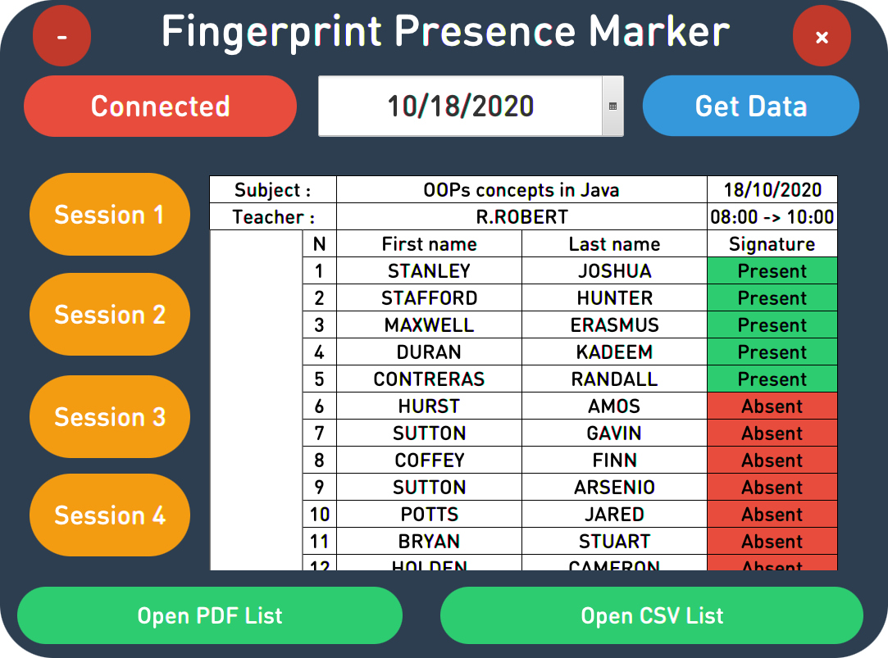

# FingerprintPresenceMarker
> Manage students attendance using fingerprint

## Built With
* [JavaFX](https://openjfx.io/)
* [Arduino](https://www.arduino.cc/)
* [Gson](https://github.com/google/gson)
* [iTextPDF](https://itextpdf.com/en)
* [Velocity](https://velocity.apache.org/)

## Prerequisites

- Install [IntelliJ IDEA](https://www.jetbrains.com/idea)
- Install [Arduino IDE](https://www.arduino.cc/en/Main/Software)

## Screenshots

## Contributing

Contributions are what make the open source community such an amazing place to be learn, inspire, and create. Any contributions you make are **greatly appreciated**.

1. Fork the Project
2. Create your Feature Branch (`git checkout -b feature/AmazingFeature`)
3. Commit your Changes (`git commit -m 'Add some AmazingFeature'`)
4. Push to the Branch (`git push origin feature/AmazingFeature`)
5. Open a Pull Request

## License
[Apache License 2.0](https://choosealicense.com/licenses/apache-2.0/)

## Contact
- Yassine Lafryhi - [@YassineLafryhi](https://twitter.com/YassineLafryhi) - [y.lafryhi@gmail.com](mailto:y.lafryhi@gmail.com)
- Project Link : [https://github.com/Yassine-Lafryhi/FingerprintPresenceMarker](https://github.com/Yassine-Lafryhi/FingerprintPresenceMarker)

>If you found this project helpful, or you learned something from the source code and want to thank me, consider buying me a cup of ☕️ : [PayPal](https://paypal.me/YASSINELAFRYHI)
